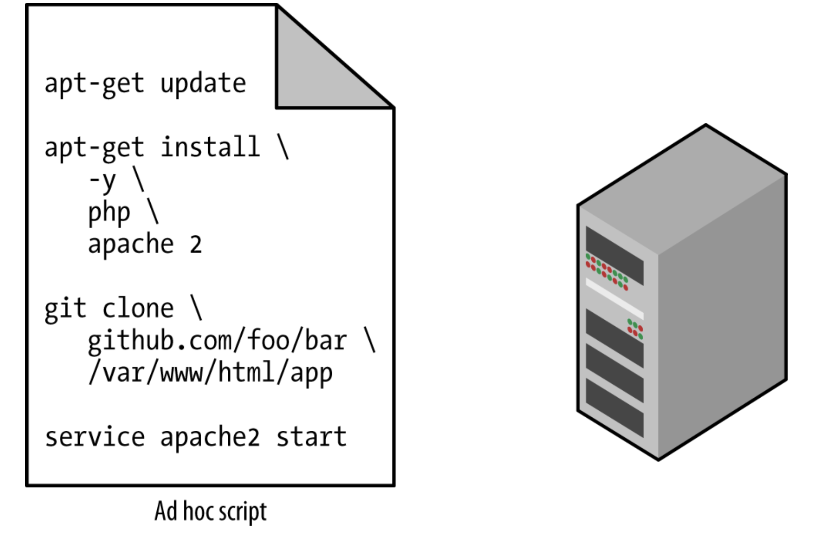
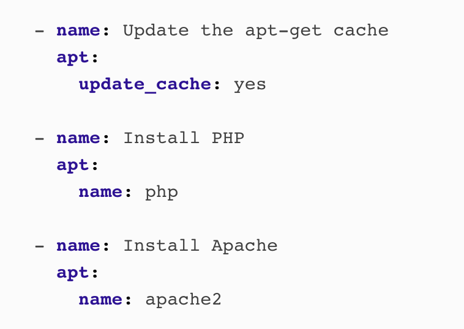
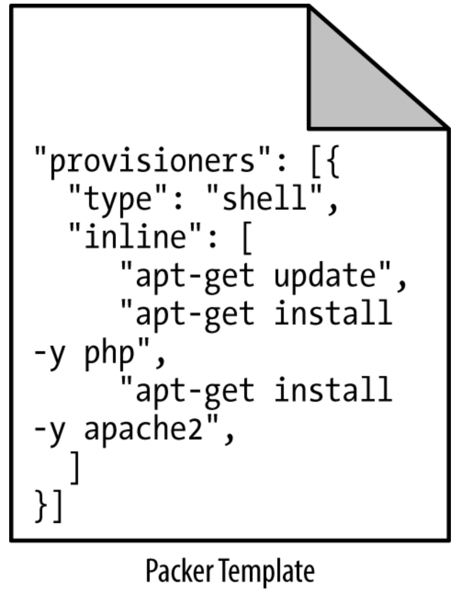

# Terraform - intro

## Terraform - Bird's Eye View

* What is Terraform?
* How does it compare to other similar tools?
* What is its place in the IaC ecosystem
    - IaC = Infrastructure as Code
    
---

## What We Will Discuss

* The rise of DevOps
* What is infrastructure as code?
* The benefits of infrastructure as code
* How Terraform works
* How Terraform compares to other infrastructure as code tools

---

## The Rise of DevOps

* Before 
    - To build a software company
    - set up cabinets and racks
    - load them up with servers, etc.
    - Set up "Devs" team, set up "Ops" team
    - Let them duke it out
* Now
    - There are AWS, Azure, GCP, etc.
    - There are Chef, Puppet, Terraform, and Docker
    - Sysadmins write code
    - Devs and Ops write code, so DevOps is born    

* The goal of DevOps is to make software delivery vastly more efficient

---

## With DevOps

* Nordstrom
    - number of features it delivered per month +100%
    - reduce defects by 50%
    - reduce lead times by 60%
<<<<<<< HEAD
* HP’s LaserJet Firmware
    - time its developers spent on developing new features went from 5% to 40%
    - overall development costs were reduced by 40%
* Four core values in the DevOps movement   
    - culture, automation, measurement, and sharing (CAMS) 
---

## What Is Infrastructure as Code?
* There are five broad categories of IAC tools:

    - Ad hoc scripts
    - Configuration management tools
    - Server templating tools
    - Orchestration tools
    - Provisioning tools

--- 

## Ad Hoc Scripts

---

## Configuration Management Tools

* Chef, Puppet, Ansible, and SaltStack
* Example of Ansible script

---

## Server Templating Tools
*  Docker, Packer, and Vagrant.

---

## Images and Containers

---
=======
    
    
    
>>>>>>> 9a4cab244e9d4dff622e64a64195e07c7603fe9e
